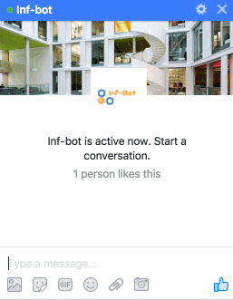

# Informaticcs ChatBot

This is a chatbot for informatics related information at the University of Edinburgh. To chat simply message the [inf-bot page on Facebook](https://www.facebook.com/infobot12). The chatbot's goal is to be more conversational in nature. I am currently working on it to understand more messages that are sent to it.

&nbsp;&nbsp;&nbsp;&nbsp;&nbsp;&nbsp;&nbsp;&nbsp;&nbsp;&nbsp;&nbsp;&nbsp;&nbsp;&nbsp;&nbsp;&nbsp;&nbsp;&nbsp;

## Usage

To chat simply message the [inf-bot page on Facebook](https://www.facebook.com/infobot12). The aim of the bot is to be more conversational, but typing 'List' or 'Get Started' will pull up a menu of suggested options. 

## Setting up a Development Enviorment

The only requirements to develop for Inf-Bot is git.

`git clone https://github.com/bnelo12/inf-chatbot.git`

The chatbot is a simple Express web app built on node.js. When you are ready to post your code live type:

`git push live master`

You will need a RSA key to do this, I plan to set up a test server so that development can be tested in a non live enviorment. test
